# ScaleOps — Automated Microservice Releases & CDN Content Delivery

[]([https://github.com/USERNAME/REPOSITORY](https://github.com/iabhishekpratap/microservices-cdn-semver))    [](LICENSE)

 ---

## Overview

As a microservice-based application grows, managing service releases specially in monorepo and delivering high-volume content becomes difficult globally.

Solves two key challenges:

- **Automated Versioning:** Detects changed microservices and creates service-specific semantic version tags in GitHub for monorepo.
- **Faster Content Delivery:** Uses **AWS S3 + CloudFront CDN** to cache video content at edge locations, reducing origin load and improving content delivery speed.

---

## Automated Microservice Release Flow

```bash
                            ┌──────────────┐
                            │   GitHub     │
                            └──────┬───────┘
                                   │
                            Code Change
                                   │
                            ┌──────▼───────┐
                            │    Jenkins   │
                            │  Freestyle   │
                            └──────┬───────┘
                                   │
                      ┌────────────┴────────────┐
                      │ Detect Changed Service  │
                      └────────────┬────────────┘
                                   │
                         Semantic Versioning
                                   │
                     ┌─────────────▼─────────────┐
                     │ GitHub Release / Tag      │
                     │ users-v1.0.0              │
                     │ video-v1.0.0              │
                     └───────────────────────────┘
```

## CDN Video Delivery Flow

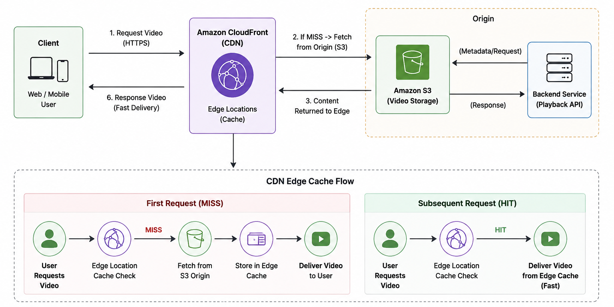

--- 

## Technical Challenges & Fixes

**Problem:**  
The release script was not correctly detecting github directory and microservice changes, while CloudFront could not securely access video objects from S3 due to incorrect bucket permissions.

**Solution:**  
Updated the change-detection logic to accurately identify github directory and microservice changes, and configured S3 bucket policies with CloudFront origin access for secure video delivery while restricting direct S3 access.


## Quick Start

For the complete infrastructure and deployment setup, see `docs/detailed.md`.

```bash
# Clone the repository
git clone https://github.com/iabhishekpratap/microservices-cdn-semver
cd microservices-cdn-semver

# Configure environment
cp .env.example .env

# Initialize database
docker compose up -d database

# Run migrations
chmod +x infra/Scripts/migration.sh
docker compose -f docker-compose.migrate.yml up --build

# Start application
docker compose up -d --build

# Check services
docker compose psrr 
```

## Repository Structure

```text
├── analytics_service/          # Analytics microservice
├── users_service/              # User/authentication microservice
├── video_service/              # Video management microservice
├── frontend/                   # Frontend application and Nginx configuration
├── database/                   # Database initialization
├── docs/                       # Detailed Docs.
├── assets/                     # contain screenshots
├── infra/                      # Infrastructure configuration & Sementic versioning script
    └── AWS/S3 
        └── bucket-policy-cloudfront.json # bucket policy for cloudfront distribution to access s3 bucket
        └── bucket-policy.json  # bucket policy to access s3 object   
    └── Scripts 
        └── migration.sh        # script responsible for the migration of the django microservice 
        └── release.sh          # script for the sementic-versioning
├── docker-compose.yml          # Main application services
├── docker-compose.migrate.yml  # Database migration services
├── requirements.txt            # Python dependencies
├── .env.example                # Example environment variables
├── .gitignore                  # Git ignore rules
└── LICENSE                     # MIT License
```

---

## Screenshots

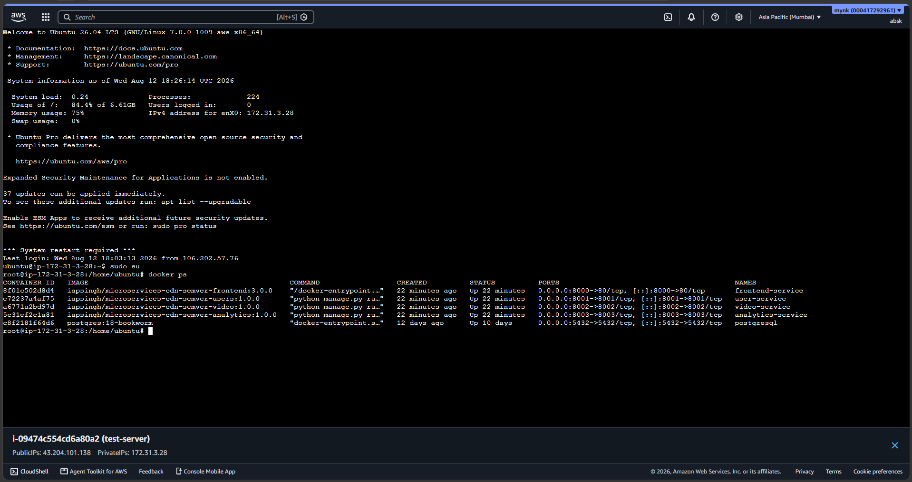

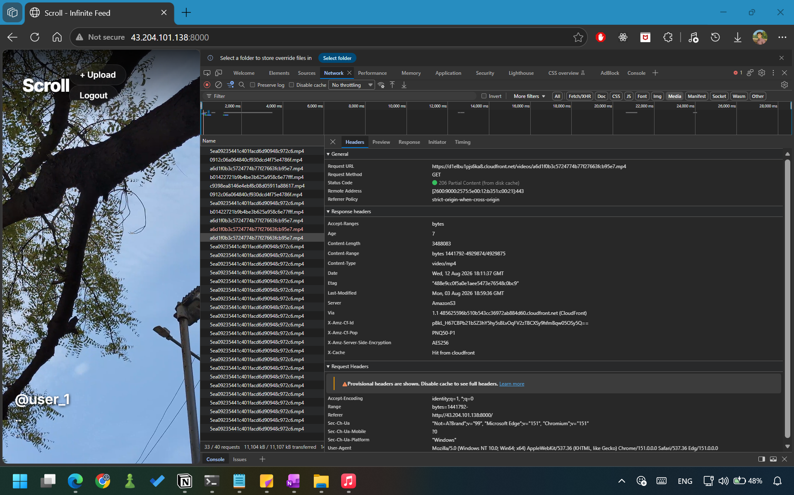

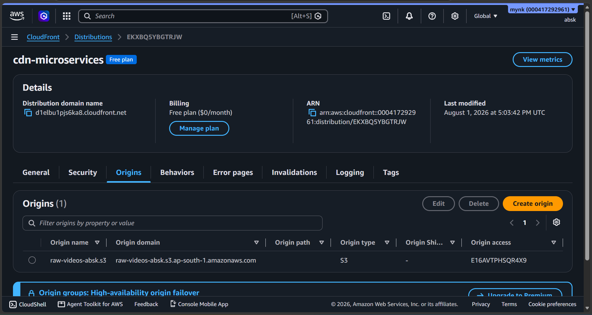

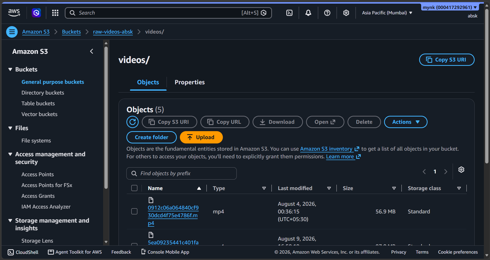

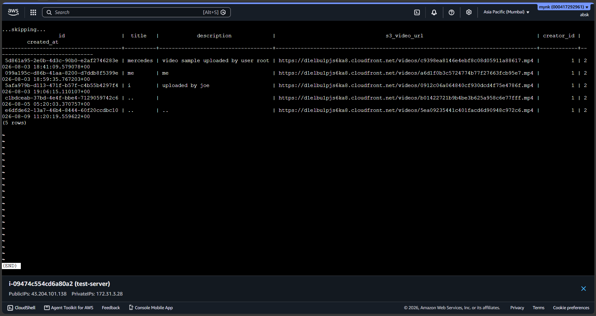

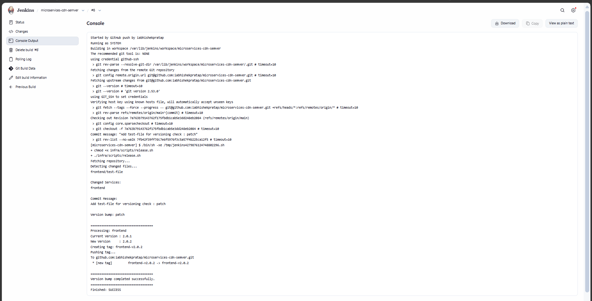

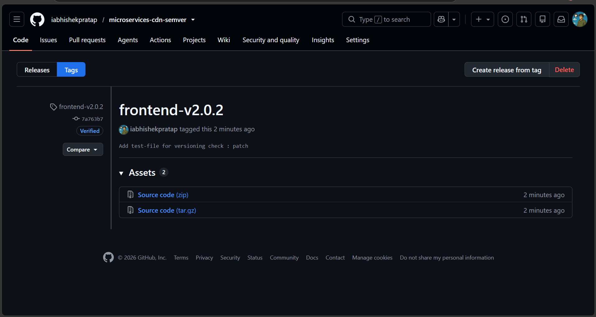

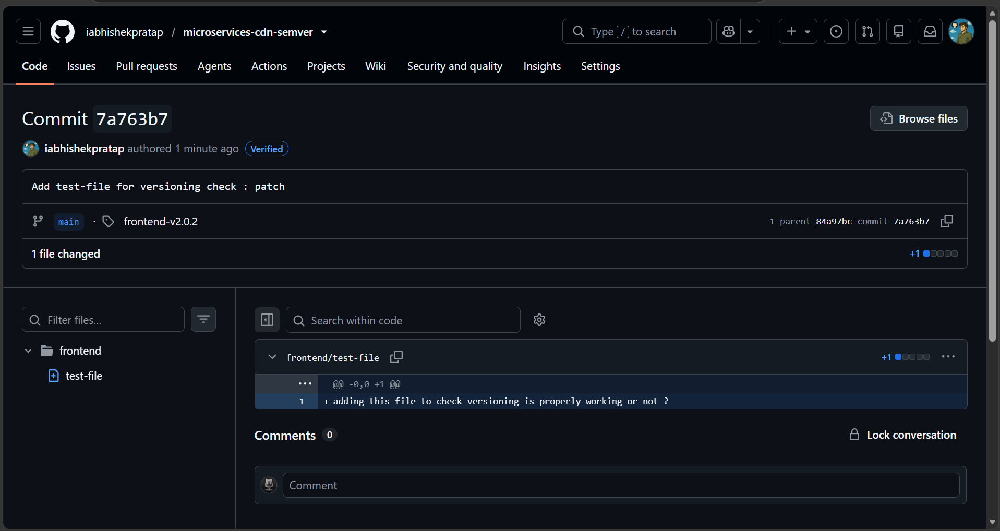

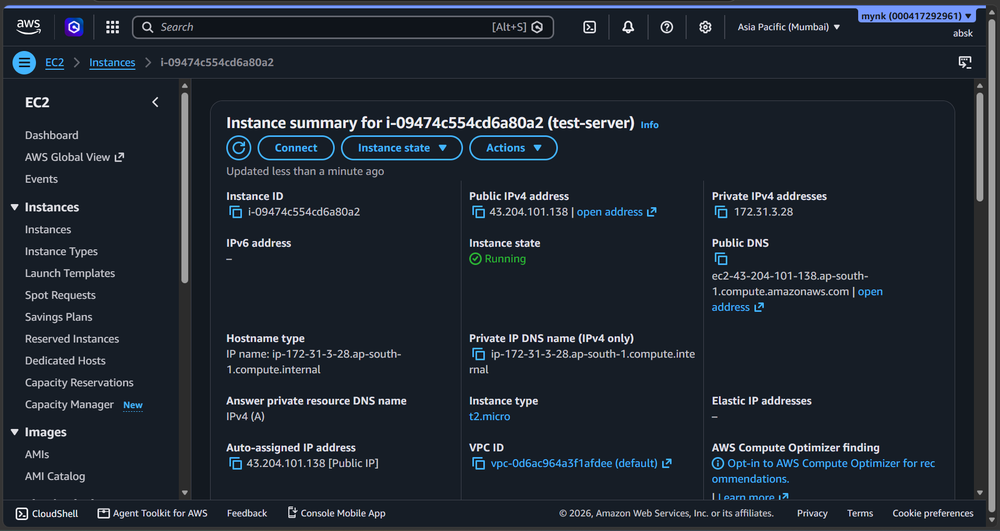

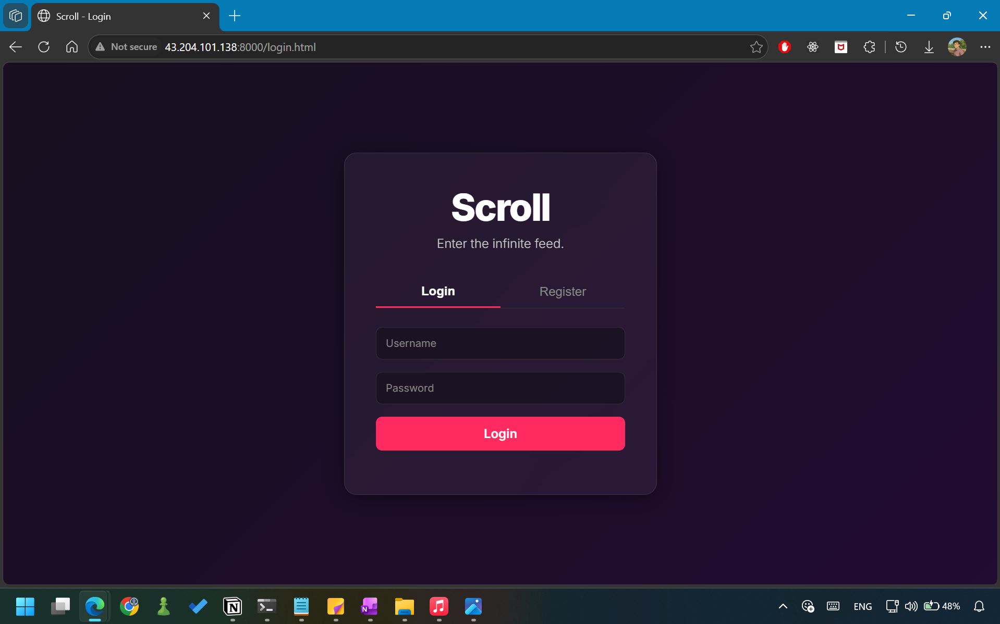

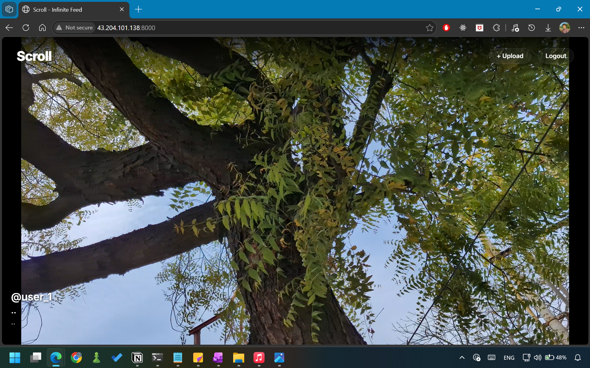
---

## Support

For issues, please open a GitHub ticket.
